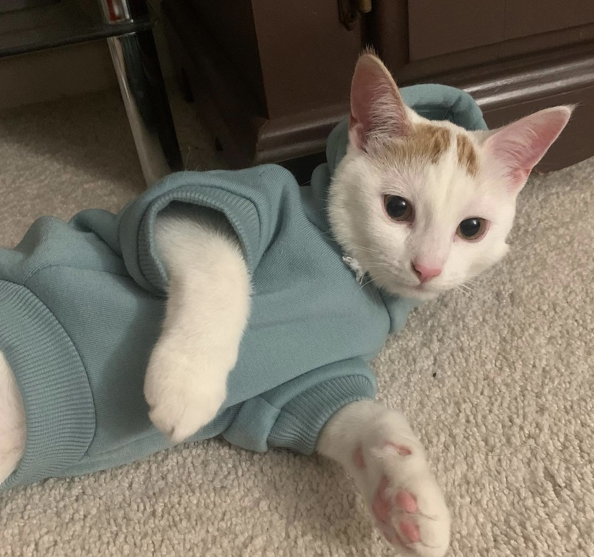

# **MMED1054 - Git & GitHub - HW1**

[Team Member #1]: #
## **Sandra Paola**

### **About Me**

#### My name is Sandra but I prefer to be called San or Paola which is my second name, I feel is easier and faster to say. I'm 18 years old and I come from Cali known as the branch of heaven in Colombia and in the world, but please don't ask me if I know how to dance salsa.

#### To get started, I'm a friendly person even though I don't seem like it because I'm a little shy and nervous when it comes to talking.

####  Continuing, one of my big hobbies is dancing (not salsa), I started about 7 years ago dancing Kpop but over time I expanded to dance more genres, I even use to have my dance cover group in Colombia where I loved participating in events.

#### Also, I love trying new food since I consider that all kinds of food have their special touch, always when I have free time and money, I really enjoy going out with my friends to eat in different places.

#### Additionally, other hobbies I have is read books online, watch TikTok SO MUCH that I even had to put a time limit on my phone, play online games, especially horror ones, and listen to music (pop, phonk, R&B, reggaeton, classic) it depends on the mood.

#### Lastly, I love animals, but my parents never let me have a pet, now that I live with my uncles here in Canada they have a kitten called Gaty, she is very cute and good company even though she has already destroyed some of my clothes and beauty blenders

### **Why IDP3?**

#### I selected this program in Fanshawe because I enjoy drawing and design that's why I want to explore my creativity and come up with new and innovative ideas, knowing different ways how to get inspiration, also I am totally new to the coding topic for which I have a lot of interest in learning and know how to handle it in the better way.

### **Gaty:**

---

[Team Member #2]: #
## **Valentina Perez**

### **About Me**

* Hey there! My name is Valentina Perez and I'm 20 years old. I was born in Orlando, Florida but my parents moved to Canada shortly after so I have been living in the city of London for most of my life.

* Aside from English, I can also speak both Spanish and French fluently. My parents are both Colombian and they taught me how to speak Spanish from an early age. As for French, I learned it during my 7 years in French Immersion.

* I attended London Central Secondary School for grade 9 to 12 and graduated in 2020. In Fall 2020 I started the Computer Programming and Analysis (CPA3) program at Fanshawe College and reached Level 4 but I utlimately decided to switch to IDP as I found myself to be more oriented towards design (illustration, graphics, etc.) and with a preference for web design and development.

* Once I graduate from IDP, I hope to find a job as either a junior web designer or front-end web developer.

### **Hobbies**

* One of my hobbies is digital art. It's something I find extremely relaxing and that I enjoy doing in my spare time. I decided to start drawing again during quarantine since I had so much time on my hands and I bought my first drawing tablet (Wacom Intuos) to experiment with digital drawing and transition from traditional drawing to digital.

* Another one of my hobbies is music. You'll always catch me wearing headphones and listening to music 24/7. Music is something I've been passionate about ever since I was little. It helps me concentrate and reduces my stress and anxiety. Aside from listening to music, I can also play several instruments (piano, clarinet, cello, and trumpet) and was involved in several music ensembles such as the school concert band and orchestra, and the Western/OBA intermediate honour band.

* I also enjoy developing Discord bots (for tracking XP, retrieving user information, calculating statistics, etc.) and learning new APIs and incorporating them into my personal projects. I mainly use JavaScript but I also have experience with Java, C#, and C/C++ from my time in the CPA3 program.

* Some of my other hobbies include: 3D modelling, watching TV shows and movies (currently watching The Last of Us and excited for the upcoming Scream VI movie), and gaming (my favourite games are the Tomb Raider Trilogy, Control, Wizard101, and Pirate101), and travelling.

### **Pets**
* I have a dog and her name is Coco. She's 10 years old. She's a rescue and was adopted in 2015. She's a mix between the pug, miniature pinscher, and dachshund.
    * Here is a picture of her:

        > 

---